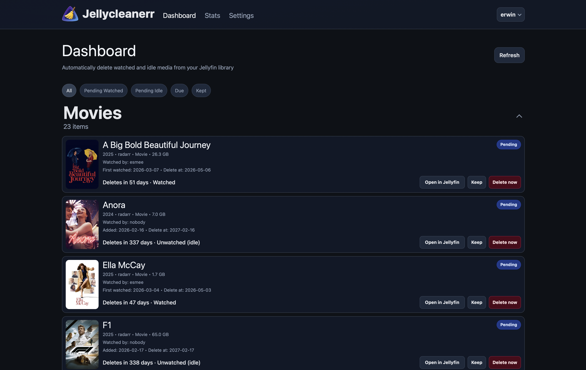
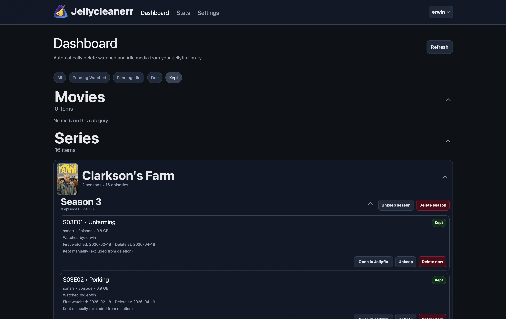
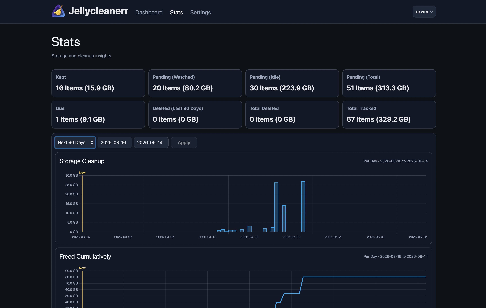

# Jellycleanerr

<p align="left">
  
</p>

Jellycleanerr helps you clean up your Jellyfin library by finding watched and idle media and (optionally) automatically deleting it. It integrates well with the *arr stack (Radarr & Sonarr) and your download client (qBittorrent & Deluge). Jellycleanerr also includes a built-in web interface, making cleanup easier to review and control.

## Features

- 🪼 **Jellyfin Cleanup Workflow** – Review watched and idle media from your Jellyfin library and decide what should stay or go.
- 🖥️ **Built-In Web Interface** – Manage cleanup from a browser with a dashboard, settings page, and statistics view.
- 👤 **Jellyfin Sign-In** – Sign in with your Jellyfin account and stay signed in for future visits.
- 👥 **User-Based Monitoring** – Choose which Jellyfin users should count toward watched status, or monitor all users.
- 📚 **Library Selection** – Limit cleanup to specific Jellyfin libraries instead of scanning everything.
- ⏳ **Watched and Idle Retention Rules** – Set separate cleanup rules for watched media and for media that has never been watched.
- ✋ **Manual Mode** – Let items move to the Due list without deleting them automatically, so you stay in control.
- 🏷️ **Keep Overrides** – Mark movies, episodes, or entire seasons to prevent them from being removed.
- 📺 **Season-Level Actions** – Keep or delete whole seasons directly from the interface.
- 🔗 **Arr Stack Integration** – Works with Radarr, Sonarr, qBittorrent, and Deluge as part of your existing media setup.
- 📊 **Cleanup Statistics** – View pending, due, kept, and deleted items, along with storage-related insights.

## Screenshots

<p>
  
</p>

<p>
  
</p>

<p>
  
</p>

## Quick Start

Use Docker Compose:

```yaml
services:
  jellycleanerr:
    image: ghcr.io/erwinrietveld/jellycleanerr:latest
    container_name: jellycleanerr
    network_mode: host
    environment:
      PORT: 8282
      INTERVAL: 45m
      LOG_LEVEL: info
      # Optional machine-readable stats endpoint auth.
      # Accepts comma-separated API keys via Authorization: Bearer or X-API-Key.
      JELLYCLEANERR_API_KEYS: your-machine-api-key
      FORCE_DELETE: "true"
      IDLE_AUTO_DELETE: "true"
    volumes:
      - /path/to/config.toml:/config/config.toml
      - /path/to/data:/data
```

Open `http://<host>:8282`, go to **Settings**, configure services, and save.

## Machine Stats API

Jellycleanerr can expose a read-only machine-friendly stats summary endpoint for dashboards and automations.

- Endpoint: `GET /api/stats/summary`
- Auth: `Authorization: Bearer <key>` or `X-API-Key: <key>`
- Env: set `JELLYCLEANERR_API_KEYS` to one or more comma-separated API keys

Example response:

```json
{
  "ok": true,
  "generatedAt": "2026-04-29T12:34:56.000000+00:00",
  "current": {
    "pendingCount": 5,
    "pendingSizeBytes": 1234567890,
    "pendingWatchedCount": 3,
    "pendingWatchedSizeBytes": 987654321,
    "pendingIdleCount": 2,
    "pendingIdleSizeBytes": 246913569,
    "keptCount": 7,
    "keptSizeBytes": 3456789012,
    "dueCount": 1,
    "dueSizeBytes": 123456789
  },
  "deleted": {
    "totalCount": 18,
    "totalSizeBytes": 4567890123,
    "recentCount": 4,
    "recentSizeBytes": 1234567890
  },
  "summary": {
    "pending": { "count": 5, "sizeBytes": 1234567890 },
    "pendingWatched": { "count": 3, "sizeBytes": 987654321 },
    "pendingIdle": { "count": 2, "sizeBytes": 246913569 },
    "due": { "count": 1, "sizeBytes": 123456789 },
    "kept": { "count": 7, "sizeBytes": 3456789012 },
    "tracked": { "count": 12, "sizeBytes": 4691356902 },
    "deletedRecent": { "count": 4, "sizeBytes": 1234567890, "days": 30 },
    "deletedTotal": { "count": 18, "sizeBytes": 4567890123 }
  }
}
```

## Development

```sh
git clone https://github.com/erwinrietveld/jellycleanerr.git
cd jellycleanerr
make image
docker run --rm -it --network host \
  -e PORT=8282 \
  -v "$PWD/config.toml:/config/config.toml" \
  -v "$PWD/data:/data" \
  jellycleanerr:dev
```

For more workflow details, see [DEVELOPMENT.md](DEVELOPMENT.md).

Frontend CSS build (optional outside Docker):

```sh
cd gui
npm install
npm run build:css
```

## Credits

- Sanitarr is the foundation of this project, created by [serzhshakur](https://github.com/serzhshakur/sanitarr).
- Jellycleanerr adds a GUI and extra workflows on top of Sanitarr.
- Parts of the cleanup model and UX were inspired by [Jellysweep](https://github.com/jon4hz/jellysweep).

## License

MIT. See [LICENSE](LICENSE).
